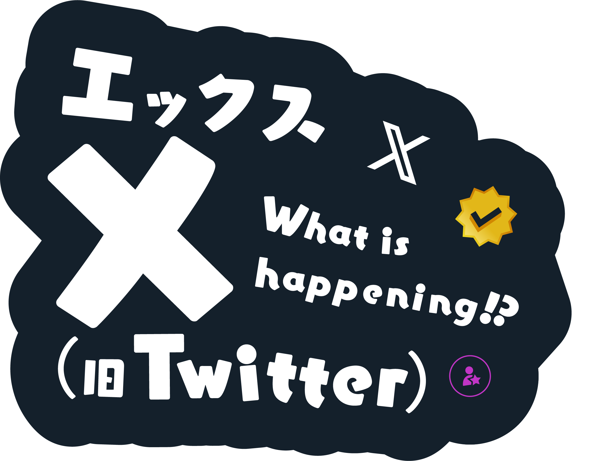
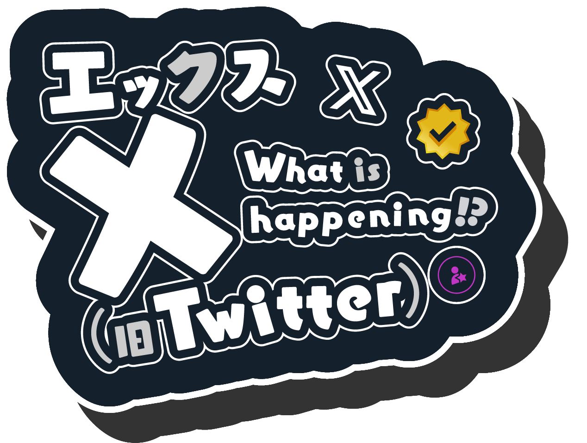
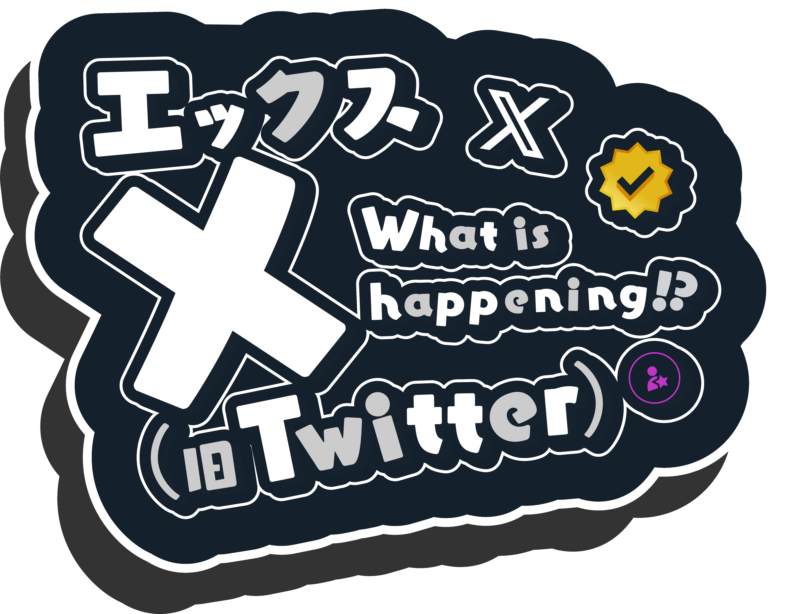

# twitter vtuber logos
[My twitter post](https://x.com/210on/status/1782415948886294905)

I share these logo so people can use it noncommercially

> [!IMPORTANT]
> # THESE ARE NOT OFFICIAL LOGOS

# Similar Projects
- [Fun logos](https://github.com/G2-Games/fun-logos) by @G2-Games
- [ProgrammingVTuberLogos Addon](https://github.com/PetricaT/ProgrammingVTuberLogos-Addon) by @PetricaT
- [ProgrammingVTuberLogos Korean Edition](https://github.com/lDMDiamondl/ProgrammingVTuberLogosKR/) by @lDMDiamondl
- [ProgrammingVTuberLogos for Visual Studio](https://github.com/hvpexe/ProgrammingVTuberLogos-VisualStudio/) by [Manhkbrady on Behance](https://www.behance.net/Manhkbrady) (repo by @hvpexe)
- [sawaratsuki1004's transparent logos](https://github.com/SAWARATSUKI/ServiceLogos) by @SAWARATSUKI [sawaratsuki1004 on Twitter](https://twitter.com/sawaratsuki1004) ([Twitter post](https://twitter.com/sawaratsuki1004/status/1782079506083381657))
